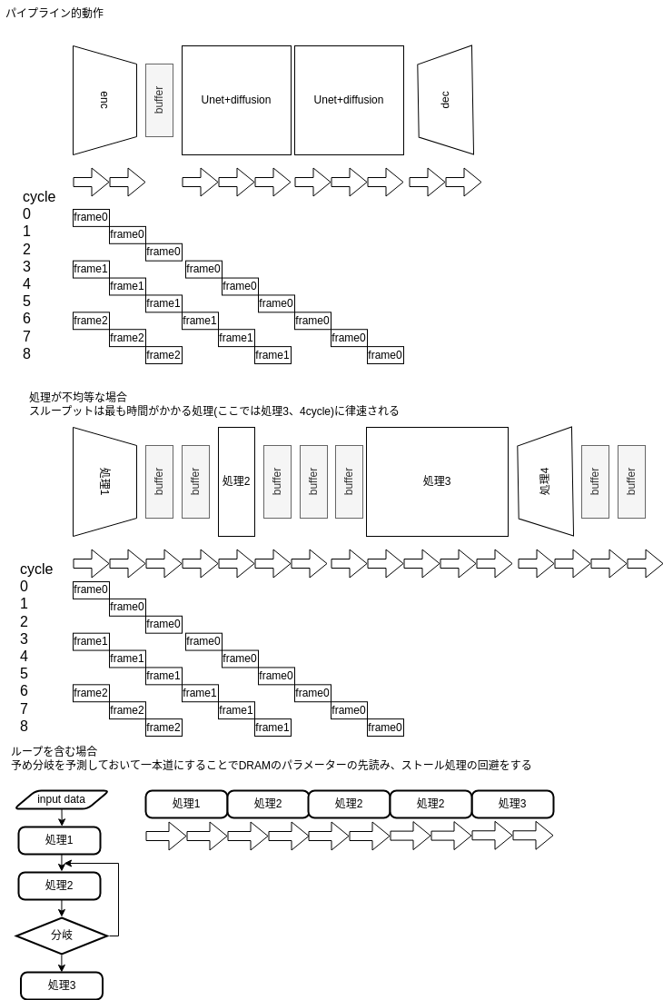

# Stable Diffusion専用プロセッサのアーキテクチャに関する試論

## 概要
画像生成などで使われるアルゴリズムであるStable Diffusionの生成処理を高スループットで実行するための回路アーキテクチャSDIPを提唱する。
またその特性の既存AIアクセラレーターとの比較について述べる。

## 回路構成と機能
数多くある拡散モデルのアルゴリズムのうちVAEで圧縮した隠れ変数に対して拡散過程を適用するlatent diffusionの演算のための回路全体を以下に図示する。

### モジュール
SDIP_top
:       トップモジュール、複数のcoreを持つ
SDIP_encoder
: VAE encoder
SDIP_decoder:
 VAE decoder
- SDIP_core: processor for diffusion process and U-net
- SDIP_IMEM: instruction memory 
- SDIP_STM: state machine
- SDIP_PSRAM: parameter memory read form DRAM
- SDIP_DSRAM: data memory for result and intermediate result of cores
- SDIP_STACKRAM: stack ram for Resnet and U-net

### 1 coreの動作

### coreのパイプライン動作

拡散モデルの大きな特徴であり
Stable Diffusionの生成処理を高スループットで実行するためのアーキテクチャSDIPの提示と既存AIアクセラレーターとの比較

### onnx変換プログラム

[onnxの仕様に定義されたoperation](https://onnx.ai/onnx/operators/)のうち、Stable diffusionの動作に最低限必要なオペレーションは以下のものになる。

add
sub
mul
div
rand
root
softmax
relu(silu)
Transpose
Matrix-Vector product
Matrix-Matrix product
conv2d
linear
groupnorm
layernorm

SDIP_ALU、SDIP_STMに追加することで拡張可能である。

## 設計空間

- coreの数
- 演算精度(数値のビット幅)
- SRAMのデータ幅
- DRAMとのクロック周波数比率
- 演算回路、SRAMの共有の程度

などが可変なパラメーターとして挙げられその組み合わせの数だけ可能な回路が存在する。Stable Diffusionのような特定のネットワークにおけるデータ転送上のボトルネックを見つけるために回路シミュレーションを利用することができる。またChiselのコードをVerilogに変換、論理合成を行うことで後述の発展的機能実装も含めて消費電力、回路面積に影響する度合いを評価することができる。

## 演算子の粒度
後述の他のAIアクセラレータと比べるとSDIPは粗粒度といえる。粗粒度はonnxを加工することなく命令列(.graph)を生成できることが利点であり、冗長な演算回路を持つことが欠点である。

## 使用テクノロジー
FPGAあるいはASIC(専用LSI)　　
微細化した製造プロセスでは相対的にSRAMのコストが高く、ロジックのコストが低くなることが報告されている。このことから冗長な
FPGA,ASIC(専用LSI)　

## プログラムの作成
onnxを分離、変換することでinstruction, weightを作り、前者はIMEM、後者はDRAMへとデータ処理前に書き込む。データ生成実行時に

## 発展的機能実装
SDIPとそのonnx converterでは実装していないが機能、効率化の観点から重要な事項を列挙する。

### 共通パラメータのハードコーディング

ASIC(専用LSI)で実装する場合には物理的配線が固定され、FPGAで実装する場合は回路情報記録するSRAMに
自然言語処理の分野などで基盤モデルと呼ばれる多くのタスクに共通して使われるニューラルネットは
AMDのNPU(Neural Processing Unit)は　FPGAをベースにしたものとされ、起動時に回路情報をSRAMに書き込むのと同じ仕組みでニューラルネットパラメーターをNPUに書き込んでいると推測される。FPGAに読み込まれる回路と同様にチップ内でのネットワークの2次元的配置がタイミング制約に影響することも考慮しているかもしれない。

### ベクトル折返し
メモリの
### layer fusion
点処理(入力テンソルの1要素にのみ出力が依存する演算)が連続する場合にはそれを
onnxを加工する
### 暗黙の転送
これもonnxには書かれていないが、書く効率的な並列演算をするためには必要になり、他社
アクセラレーターでも実装されている
### 量子化

### 粗行列対応
https://www.frontiersin.org/articles/10.3389/felec.2022.847069/full では
LLM
### 汎用化
onnxの演算粒度をより細かい命令列に噛み砕くように変換しなければいけない。
coreごとに異なる重み(weight)の使用

### 並列ネットワーク

### Resnet,U-net以外の分岐するネットワーク対応

### 多段パイプラインによる動作周波数向上

### ステートマシンの分散化

機能的なまとまりの観点からALU内の各演算器がそれぞれステートマシンをもち状態を管理するほうが
追加

## 他アーキテクチャとの類似点、相違点
特にサーバー、クラウドを標榜したものだと
[GoogleのTPU]( https://cloud.google.com/tpu/docs/intro-to-tpu?hl=ja)
、[QuadricのChimera GPNPU]()、[Tesla のDojo]()、[tensortorrentのRISC-Vベースのマルチコアプロセッサ]、[graphcoreのIPU]()などがある。これらは拡散モデルも含む大規模なニューラルネット　多くはonnxインターフェースに加えpytorch等のディープラーニング記述を
類似のAIアクセラレーターでは
tensortorrentはCUDAのcupy(PFNによってメンテナンスされている)を　BUDAの開発を標榜している。
画像等を処理するCNNの高速化、低消費電力化のためには隣接するコアでメモリ、レジスタを共有するアーキテクチャが
組み込み系では
一方でSDIPは1 core内部で直線的な計算グラフの演算を完結させ、ハードウェア並列性をデータ並列化ではなくパイプライン化、スループットの向上に用いている。VAEを用いて画像をより次元の小さい潜在変数空間に圧縮するlatent diffusionの構成と親和性が高いと言え、その限界を持っていると思われる。
DRAM転送のボトルネック
このようなlatent diffusionの特質は専らNvidiaを用いｍそのハードウェア的制約のなかで行われている画像生成アルゴリズムの研究開発の歴史の結果として生じたものであると推測でき、上記の他のニューラルアクセラレータを用いた

## まとめ
本文ではStable Diffusion専用プロセッサの構成、動作の一例とその実装のあたって考慮すべき事項、
既存のAIアクセラレーターとの類似点、相違点と拡散モデルや他のアルゴリズムが性能に与える影響について考察した。

## 各社のニューラルアクセラレータに関する情報とニュース
### 各社紹介、ネットニュース
- [tensortorernt RISC-V](https://tenstorrent.com/)
    - [https://tenstorrent.com/risc-v/](risc-vを用い階層的キャッシュを持ったマルチコア、タイリングCPUクラスタ)
- [PFN MN-core](https://projects.preferred.jp/mn-core/)
    - https://jun-makino.sakura.ne.jp/talks/postfugaku-20230222.pdf
    https://www.pccluster.org/ja/event/pccc20/data/pccc20_S6_hiraki.pdf
- [google TPU](https://cloud.google.com/tpu/docs/intro-to-tpu?hl=ja)  
    - [3世代のTPUに関する講演のまとめ]https://kiszk.github.io/2019/12/31/Three-Generations-of-TPUs/
- [quadric Chimera GPNPU](https://quadric.io/)
    - [LLMのインポート](https://quadric.io/large-language-models/?gclid=Cj0KCQiAuqKqBhDxARIsAFZELmJYni07gU2dk3cOeVKrDRRpB3sRLt6YRIdaklzRJ9OypwD8PJielawaArTaEALw_wcB)
    大規模言語モデルであるLlamaの移植速度の速さを優位性の指標としている。
- Tesla Dojo
    - [ホワイトペーパー](https://en.wikipedia.org/wiki/Tesla_Dojo#cite_note-:1-21)
    -AI dayの情報が各所に散在していて[Wikipedia](https://en.wikipedia.org/wiki/Tesla_Dojo#cite_note-:1-21)が比較的まとまっている。
    - https://www.nextplatform.com/2022/08/23/inside-teslas-innovative-and-homegrown-dojo-ai-supercomputer/

- [graphcore IPU](graphcore.ai/ja-jp/)
    - [ベンチマーク](https://www.graphcore.ai/performance-results)
    - [SDKとソフトウェアスタック,dockerが利用できる](https://www.docker.com/ja-jp/blog/graphcore-poplar-sdk-container-images-now-available-on-docker-hub/)
    - [インタビュー記事](https://eetimes.itmedia.co.jp/ee/articles/2209/16/news096.html)クラウドでの学習をターゲットとしている
- [AMD NPU](https://www.amd.com/ja/processors/ryzen)
> AMDによれば、このNPUは、AMDが買収したXilinxのFPGAがベースになっており、そのFPGAのロジックがPhoenixのダイに含まれており、プログラマブルになっているのも大きな特徴だ。 https://pc.watch.impress.co.jp/docs/news/event/1467965.html
- [AMDとXilinxのAI開発プラットフォームを統合](https://monoist.itmedia.co.jp/mn/articles/2206/28/news050_3.html)

### 論文
粗行列処理に対応しLLMをターゲットとしたアクセラレータ
- [Co-Design of an In-Memory Transformer Network Accelerator](https://www.frontiersin.org/articles/10.3389/felec.2022.847069/full　Hardware-Software)
- [Symphony: Orchestrating Sparse and Dense Tensors with Hierarchical Heterogeneous Processing](https://dspace.mit.edu/handle/1721.1/152619)

### その他参考にしたリンク
- layernorm,groupnormについて
    - https://gaoxiangluo.github.io/2021/08/01/Group-Norm-Batch-Norm-Instance-Norm-which-is-better/
    -