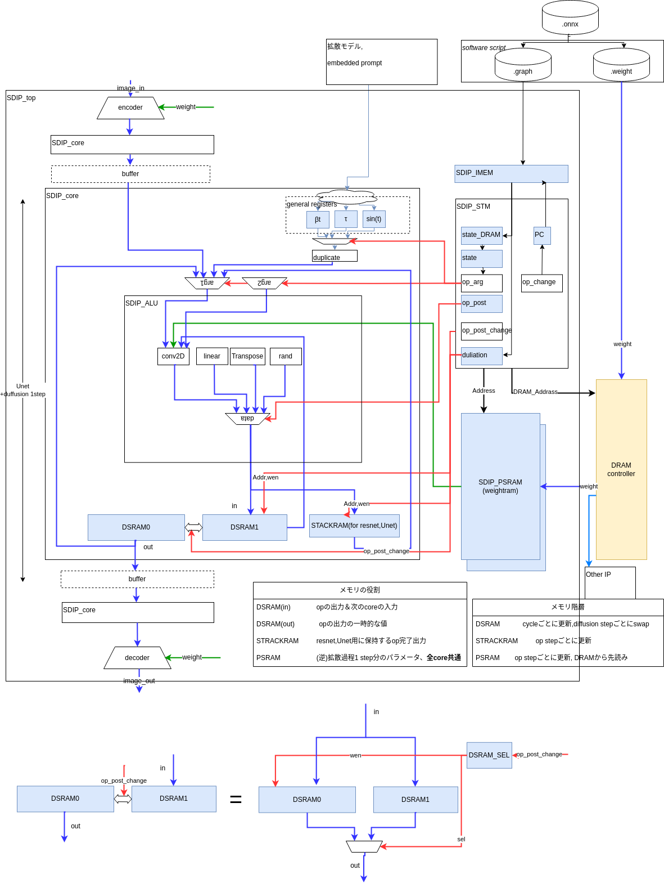
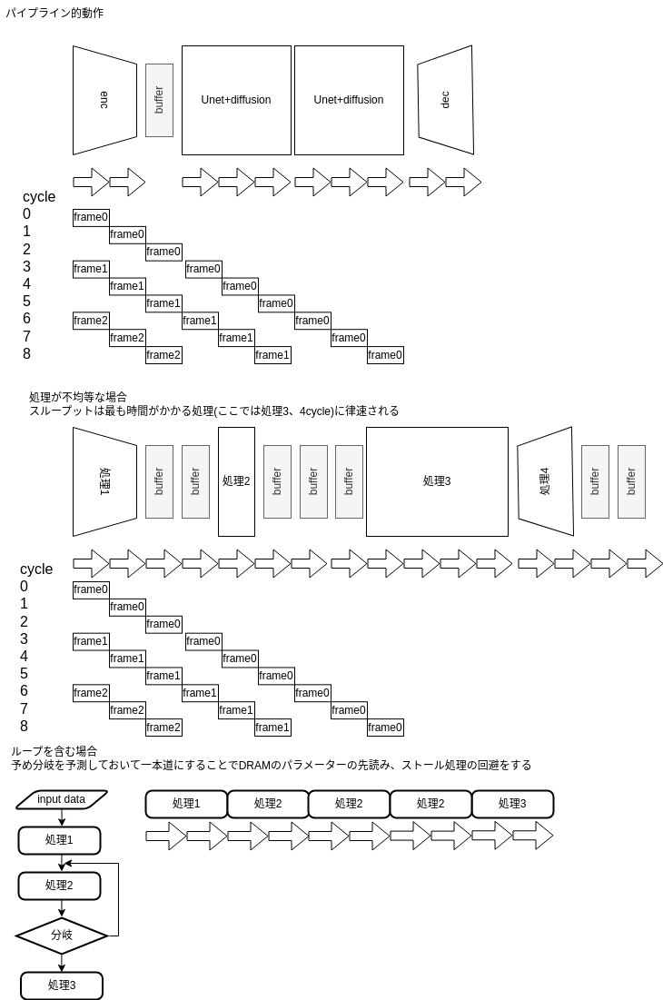
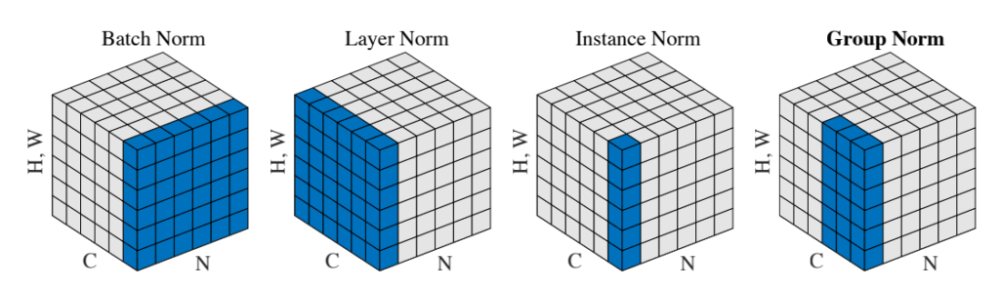

# An essay on architecture of processor dedicated to Stable Diffusion

## overview
We propose a circuit architecture, SDIP, for executing Stable Diffusion generation processing, an algorithm used in image generation, with high throughput for purposes such as real-time video conversion.

We will also discuss its characteristics in comparison with existing AI accelerators.

## Circuit Configuration and Functions
Among the many diffusion model algorithms, SDIP specifically targets the operation of [latent diffusion](https://arxiv.org/abs/2112.10752), which applies a diffusion process to hidden variables compressed by VAE.

The overall circuit configuration is illustrated below.



### Modules
|module name|function|
|:----|:----|
|SDIP_top|top module, with multiple cores|
|SDIP_encoder|VAE encoder|
|SDIP_decoder|VAE decoder|
|SDIP_core|core that computes the diffusion process of 1~several steps|
|SDIP_IMEM| instruction memory|
|SDIP_STM| state machine|
|SDIP_PSRAM|SRAM to store the weight parameters for one step read from DRAM
|SDIP_DSRAM|SRAM to hold the data calculated in the previous core and the data in the process of calculation
|SDIP_STACKRAM|Stack to hold the residual variables needed by Resnet and U-net
|SDIP_ALU|Module containing each operator and its output selector


### 1 core operation

The implementation is https://github.com/xiangze/SDIP/blob/main/src/main/scala/sdip/SDIP_core.scala

A line specified by the PC (program counter) register in the .graph file describing the graph structure extracted from the onnx file is read from IMEM, and the signal op signal is selected based on the value of the operation.

The .graph file corresponds to a machine language that is read in sequence without branching and has the following fixed-length format.

|operation|	src1|	src2|	dst	|src1 size|	src2 size|
|:----|:----|:----|:----|:----|:----|


src1 and src2 correspond to either the result of the previous core calculation, data stored in STACKRAM, a duplicate of a scalar value stored in the gereral register, or a weight parameter stored at a specific address in PSRAM that is read out by addressing it. The PSRAM address is incremented by src1 size, src2 size.

The outputs of conv2d, linear, transpose and other arithmetic circuits selected according to operation(op) are recorded as data in DSRAM and, if necessary, in STACKRAM.

Each operation requires cycles according to src1 size and src2 size, which are counted by the dulation signal.

When the operation is completed, DSRAM1, in which the final result is written, is replaced by DSRAM0, the dulation is reset, PC is incremented, the next graph row is read, and the operation is repeated. The addresses of DSRAM and STACKRAM are incremented by the sizr of dst calculated from the size of src1 and src2.


### core pipeline operation

The implementation is at https://github.com/xiangze/SDIP/blob/main/src/main/scala/sdip/SDIP_top.scala

Input image data is compressed by a VAE (variable autoencoder) encoder, then a multi-step diffusion process is applied to it, and the data is converted back to an image by a decoder. The goal is to process streaming input such as video in real time by dividing the multi-step diffusion process among cores in series.

Each core stores the number of steps t, sin(t) (periodicity), $\tau$ (prompt embedded in vector space), and parameters of the diffusion model in general-purpose registers and uses them.
When the input image is random, it corresponds to text to image(t2i), which is generated from the information in text(prompt) only.

The main characteristics of the diffusion model are that it generates data in multiple steps, and that the parameters required for each step are the same, and only the noise variance is different.
The parameters required for each step are the same, and only the noise variance is different. Therefore, as shown in the figure, the exact same weight parameters can be read from PSRAM for each core. However, only the VAE encoder and decoder will read different parameters. If the number of cores is not sufficient for the required number of steps, one core performs multiple operations, and the throughput is reduced by that amount.

The second figure shows a more general situation in which the number of cycles required for each process is different. In this case, the throughput is scaled to the most time-consuming process.

Unlike ordinary machine language, .graph files do not contain branch instructions or loops, and ONNX logic will only accept loops that have been expanded.



### onnx conversion program
Based on the description in [stable-diffusion-pytorch](https://github.com/kjsman/stable-diffusion-pytorch)
operations defined in [operations defined in the onnx specification](https://onnx.ai/onnx/operators/), the minimum operations required for Stable diffusion to work are as follows.

|operations|number of input arguments (arg)|weight|dimension of latency|
|:----|:----|:----|:----|
|copy|1|none|0|
|add|2|none|0|
|sub|2|none|0|
|mul|2|None|0|
div|2|none|0|0|
|rand|0|None|0|
|sqrt|1|None|0|
|softmax|1|None|0|
|relu|1|None|0|
|silu|1|None|0|
|Transpose|1|None|2~|
|Matrix-Vector product|2|None|2|2
|Matrix-Matrix product|2|None|2|
|Conv2d|1|Yes|1|
|linear_batch(full connection)|1|Yes|2|
|linear_batch(full connection)|1|Yes|2~|
|groupnorm|1|Yes|2~|
|layernorm|1|Yes|2~|

For groupnorm and layernorm, see the figure below and [Other References](###Other References)

$y=\frac{x-E[x]}{\sqrt{Var[x]+\epsilon}}*\gamma+\beta$!



Adapted from [Group normalization](https://arxiv.org/abs/1803.08494)

Other operations defined in onnx can also be extended by adding operations and required cycles to SDIP_ALU and SDIP_STM.

## Design Space and PPA Analysis
In the SDIP architecture
- Number of cores
- Compute precision (bit width of number)
- Data width of SRAM
- Clock frequency ratio with DRAM
- Degree of sharing of arithmetic circuits and SRAM

Circuit simulation can be used to find data transfer bottlenecks in specific networks such as Stable Diffusion.
For the generation process performed on fixed network parameters, the amount and speed of operations are independent of the input image data and training data. However, this is not the case when coarse matrix compression or distillation is used for the parameters.
By converting Chisel code to Verilog and performing logic synthesis, it is possible to evaluate the degree to which throughput performance, power consumption, and circuit area (PPA) are affected, including the implementation of advanced functions described below.

The throughput, operating frequency, area, and accuracy of a particular circuit configuration with a set of commonly used networks as input can be defined as objective functions, and their optimization can be considered using machine learning. In this case, it may be said that data generation is the optimization of the potential function (score function) obtained by learning, learning of the potential function (score function) is the optimization for a fixed set of input data and network architecture, and optimization of the circuit configuration is the optimization for a set of commonly used networks, and so on in a hierarchical manner. The circuit configuration optimization is a hierarchical optimization for a set of commonly used networks.

### Operator Granularity
Compared to the other AI accelerators described below, SDIP can be considered coarse-grained. The advantage of coarse granularity is that it can generate a sequence of instructions (.graph) without processing onnx, while the disadvantage is that it has redundant arithmetic circuitry.

### Implementation Technology
The optimal combination of FPGAs or ASICs (dedicated LSIs) and their respective manufacturing processes differ in terms of the size and speed of the arithmetic unit and SRAM.
It has been reported that the area and power cost of SRAM is relatively high and the cost of logic is relatively low in the most advanced miniaturized semiconductor manufacturing processes. Therefore, it is expected that allowing redundant arithmetic circuits and saving SRAM will be the key to higher efficiency, and the circuit configuration in SDIP, such as sharing DSRAM and STACKRAM instead of sharing arithmetic circuits in the ALU, is consistent with this direction.

## Program from onnx, create weight data and write to RAM
By separating and converting onnx, create an instruction string (.graph) and a binary (.weight) with parameters, and write the former to IMEM and the latter to DRAM before data processing. The former is written to IMEM and the latter to DRAM before data processing.
The process of allocating data appearing in ONNX at the time of graph creation to a specific location in PSRAM corresponds to the compiler's register allocation.

Residual data should be marked on the line of the graph to indicate that it should be read or written to STACKRAM.

## Developmental function implementation
The following is a list of important items that are not implemented in the current SDIP and its onnx converter, but are important from the viewpoint of functionality and efficiency.

### Hard-coding of common parameters

In image generation, the learned parameters are not changed frequently, but the input text (prompt) is usually changed to change the object to be drawn or the style of the image. Therefore, for users who do not require a specialized style or scene, it is possible to provide only fixed network parameters. This is similar to prompt engineering, which attempts to make the LLM behave as desired only by devising the input text.
Neural nets, which are commonly used in many tasks called infrastructure models used in the field of natural language processing, are highly general-purpose and can be hard-coded in many aspects in the same way.
AMD's NPU (Neural Processing Unit) is said to be based on the FPGA, and it is said that the circuit information is written into the SRAM at startup. It is assumed that AMD's NPU (Neural Processing Unit) is based on FPGA and writes neural net parameters to the NPU in the same way that circuit information is written to SRAM at startup.

### Vector Foldback
When reading/writing data that exceeds the bit width of the SRAM, it is necessary to access the data in sequence over multiple cycles. Similarly, if the data exceeds the bit width of the arithmetic circuit, operations must be performed in sequence over multiple cycles. This is a trade-off between circuit size and throughput.

### layer fusion
In the AI accelerator industry, it is well known that when there is a sequence of point operations (operations whose output depends on only one element of the input tensor), they can be merged into a single operation to reduce SRAM accesses. The method can be achieved by processing the onnx into graphs and weights.

### Implicit transposition
This is also not explicitly written in onnx, but can be used to perform efficient parallel operations by transposing tensors on the operator inputs. tech/17657/). This can be done by inserting a Transpose operation when processing the .graph (static support) or by performing Transpose → other processing at runtime (dynamic support), which may also be implemented by other AI accelerators.

### Fixed-point, Quantization
In general, machine learning is often performed in floating-point precision, but the size of weight parameters is often an issue when performing inference and generation processing on edge devices, so fixed-point quantization or quantization to low bits such as 8-bit or 4-bit is used.
Chisel's generic programming can handle this problem, and a trade-off between accuracy and performance can be explored. Floating-point circuits can also be used to encompass fixed-point circuits, and circuits with larger bit counts can encompass circuits with smaller bit counts.
In LLMs, it has been reported that even 4 bits can provide acceptable accuracy [^1].
[^1]: [Faster and More Efficient 4-bit quantized LLM Model Inference](https://openmmlab.medium.com/faster-and-more-efficient-4-bit-quantized-llm-model-inference-a27d35a66c29) [](https://arxiv.org/abs/2310.16836v1)

### Distillation, dynamic matrix factorization, decompression of compressed parameters
The impact on accuracy is considered to be small compared to quantization. There are ways to have another circuit, such as a CPU, perform the operations of dynamic matrix factorization and decompression of compressed parameters.

### Sparse Matrix, Tensor Support.
[Hardware-Software Co-Design of an In-Memory Transformer Network Accelerator](https://www.frontiersin.org/articles/10.3389/felec.2022.847069/full) implements a function to transform sparse matrix products used in the Transformer, Attension (attention mechanism) and reports a reduction in the amount of operations.

### Reduction of circuit size
It is redundant to have parallel sum-of-products operators in each arithmetic circuit. The circuit scale can be reduced by sharing them.
As with vector folding and implicit transposition, the granularity of onnx operations must be converted to a finer instruction sequence, which requires dynamic conversion equivalent to the microcode of a CPU.

### Generalization or further specialization
Stable diffusion dedicated circuits are too limited in their targets, so generalization is required.
- Integration of DSRAM and STACKRAM
- Increase the degree of freedom of connection by providing buffers and crossbars between cores.
- Create a hierarchical cache by allowing write access to PSRAM

The following is a possible solution. Another possibility is to completely software-enable the state machine STM function and have the CPU perform it.
```c
int state=imem[pc];
```
The address and write enable of PSRAM and DSRAM are also rewritten as variables, and a DMA (Direct Memory Access) circuit is activated to transfer data and parameters between cores. In this case, if all cores operate in the same way, the address and write enable can be rewritten only once, but if different operations are enabled for generalization, it will take a cycle for the number of cores.

On the other hand, in the direction of specialization, in addition to the hard-coding of the parameters already mentioned, it is possible to have a DSRAM for each arithmetic unit so that they can operate completely independently, which would allow superscalar-like operation in CPUs and increase throughput, or to create dedicated circuits for VAE encoder/decoder, etc. This is a possible solution.

### Use of different weights for each core
When pipelining networks other than the diffusion model, the VAE encoder/decoder part of the SDIP is a different network from the diffusion model. Simply increase the PSRAM width, or prepare multiple PSRAMs for different networks. Or, it is necessary to place operations to be executed in parallel in each network in the DRAM in advance so that they are adjacent to each other.

### Parallel Networks
The Residual part of the Resnet and U-net networks is configured to leave the data as it is without processing operations on one of the branches. The typical network that performs both sides of the branching is the multi-head attention seen in the Transformer. The same network can also be applied to different input data. To support parallel pipeline execution of networks, it is necessary to add connections to branch input/output data, connections between cores, or connections between cores.

### Support for branching networks other than Resnet and U-net
Resnet and U-net allow only nested creation and consumption of residual data, so they can be handled by stack structure. If other branches are allowed, dynamic memory allocation and release will be required, and a mechanism similar to memory management by the OS will be necessary.
### Improvement of Operating Frequency by Multi-stage Pipelining
As in general clock synchronous circuits, including CPUs, the insertion of pipeline registers between combinational circuits improves operating frequency. However, this is not the case when memory separation and superscalarization are performed for each operation as described above.

### Distributed State Machines
From the viewpoint of functional coherence, it is easier to understand if each operator in the ALU has its own state machine and manages its own state, and only SDIP_ALU needs to be edited when adding operations. On the other hand, the mediation between operators is more difficult to understand.

## Similarities and differences with other architectures and their relationship to algorithms
Especially for server and cloud advocacy, [Google's TPU](https://cloud.google.com/tpu/docs/intro-to-tpu?hl=ja)
PFN's MN-Core](https://projects.preferred.jp/mn-core/), [quadric's Chimera GPNPU](https://quadric.io/),
[Tesla's Dojo](https://www.tesla.com/ja_jp/AI), [tensortorrent's RISC-V based multi-core processor](https://tenstorrent.com /risc-v/), and [graphcore's IPU](graphcore.ai/en-us/). These are for training, inference, and generative processing of large neural nets, including diffusion models. Many of them support deep learning descriptions such as pytorch in addition to the onnx interface.
Quadric supports programming in c++, and tensortorrent advocates the development of BUDA to replace CUDA and pytorch backend cupy (maintained by PFN).

In order to increase the speed and reduce the power consumption of CNNs that process images, etc., architectures that share memory and registers among neighboring cores are often used, especially in embedded systems. SDIP, on the other hand, completes linear computational graph operations within a single core and uses hardware parallelism not for data parallelism but for pipelining and throughput improvement. It is highly compatible with latent diffusion configurations that use VAE to compress images into smaller dimensional latent variable spaces, while at the same time being constrained by its limitations.
Such characteristics of latent diffusion can be assumed to be the result of a history of research and development of image generation algorithms conducted exclusively on Nvidia GPUs and within their hardware limitations. As learning with other neural accelerators mentioned above becomes more common, different types of networks may come into the limelight.

In the identification and generation process using a large number of parameters obtained by deep learning, the bandwidth required to read huge parameters from memory is likely to become a bottleneck. Among them, RNN networks such as LSTM, which repeatedly use the same parameters while changing the data, are expected to have high compatibility with hardware architectures, but the history of research and development with GPUs has shown that the opposite is true: the choice was made to use huge matrix products in Attention. It cannot be simply said that a diffusion model that uses the same parameters in multiple steps in a slightly different manner is more performance efficient for limited memory bandwidth, but it may be said that it is able to capture features of data with a self-similar structure such as images in the learning process.

## Summary
In this paper, we have described an example of the configuration and operation of a dedicated Stable Diffusion processor and listed the issues to be considered when implementing the processor. The features are
- Circuit structure that does not require crossbar, branch prediction, and stall by series operation.
- Since only the generation process is performed, the weight parameters are only read from DRAM, eliminating the need for a cache.
- The same parameters are used for all steps and cores in the diffusion model execution.
- The diffusion process handles hidden variables, so parallel processing can be completed in one core.

The similarities and differences with existing AI accelerators and the impact of diffusion models and other algorithms on performance are also discussed.

## Information and news about neural accelerators from various companies
### Introduction to each company and online news.
- [tensortorernt RISC-V](https://tenstorrent.com/)
    - [https://tenstorrent.com/risc-v/](multi-core, tiling CPU cluster with hierarchical cache using risc-v)
- [PFN MN-Core](https://projects.preferred.jp/mn-core/)
    - [Development of Deep Leaning Accelerator in PFN (pdf)](https://www.pccluster.org/ja/event/pccc20/data/pccc20_S6_hiraki.pdf)
    - [Slides by Prof. Junichiro Makino, Kobe University (pdf)](https://jun-makino.sakura.ne.jp/talks/postfugaku-20230222.pdf)
        The slide shows the optimal memory hierarchy from the viewpoints of hardware architects and software (apps), respectively, and introduces the difficulties of HBM (High Bandwidth Memory) and the 3D implementation that will solve them.
22 Quotes from the table of each company's architecture on page 22

| |MN-Core| Sunway |PEZY| GPU(A100)|
|:----|:----|:----|:----|:----|
|SIMD/MIMD |SIMD| MIMD |MIMD| SIMD Block|
|Cache |None| None| Yes| Yes| 
|Core-to-core communication |Tree| Hypercrossover| Via cache| Via cache|

Unlike traditional supercomputers and GPUs, MN-Core has no cache and performs hierarchical inter-core communication.

- [google TPU](https://cloud.google.com/tpu/docs/intro-to-tpu?hl=ja)  
    - [summary of talks on 3 generations of TPUs](https://kiszk.github.io/2019/12/31/Three-Generations-of-TPUs/)
- [quadric Chimera GPNPU](https://quadric.io/)
    - [LLM import](https://quadric.io/large-language-models/?gclid=Cj0KCQiAuqKqBhDxARIsAFZELmJYni07gU2dk3cOeVKrDRRpB3sRLt6YRIdaklzRJ9) OypwD8PJielawaArTaEALw_wcB)
    The speed of porting Llama, a large language model, is used as an indicator of superiority.
- [Tesla Dojo](https://www.tesla.com/ja_jp/AI)
    - [White paper](https://en.wikipedia.org/wiki/Tesla_Dojo#cite_note-:1-21)
    -AI day information is scattered all over the place and [Wikipedia](https://en.wikipedia.org/wiki/Tesla_Dojo) is relatively well organized.
    - https://www.nextplatform.com/2022/08/23/inside-teslas-innovative-and-homegrown-dojo-ai-supercomputer/

- [graphcore IPU](graphcore.ai/en-jp/)
    - [benchmarks](https://www.graphcore.ai/performance-results)
    - [SDK and software stack, docker available](https://www.docker.com/ja-jp/blog/graphcore-poplar-sdk-container-images-now-available-on-docker-hub /)
    - [Interview](https://eetimes.itmedia.co.jp/ee/articles/2209/16/news096.html) [Targets learning in the cloud
- [AMD NPU](https://www.amd.com/ja/processors/ryzen)
> According to AMD, the NPU is based on FPGAs from Xilinx, which AMD acquired, and the FPGA logic is included in the Phoenix die, making it programmable. https://pc.watch.impress.co.jp/docs/news/event/1467965.html
- [Integrating AMD and Xilinx AI Development Platforms](https://monoist.itmedia.co.jp/mn/articles/2206/28/news050_3.html)

### Papers
- [Co-Design of an In-Memory Transformer Network Accelerator](https://www.frontiersin.org/articles/10.3389/felec.2022.847069/full　Hardware-Software)

    The accelerator supports sparse matrix processing, targets LLMs, and stores weight parameters in memory using non-volatile ferroelectric field-effect transistors (FeFETs) that can coexist with CMOS and are in close proximity to the arithmetic circuitry. This technology solves the memory bandwidth bottleneck.

- [Symphony: Orchestrating Sparse and Dense Tensors with Hierarchical Heterogeneous Processing](https://dspace.mit.edu/handle/1721.1/152619)
    Designs for coexistence and coordination of sparse and dense tensors by optimizing data organization throughout the memory hierarchy.

### Other links for reference
- About layernorm and groupnorm
    - Original paper [Group normalization](https://arxiv.org/abs/1803.08494)
    - https://gaoxiangluo.github.io/2021/08/01/Group-Norm-Batch-Norm-Instance-Norm-which-is-better/
    - https://zuoli.tech/?p=191

