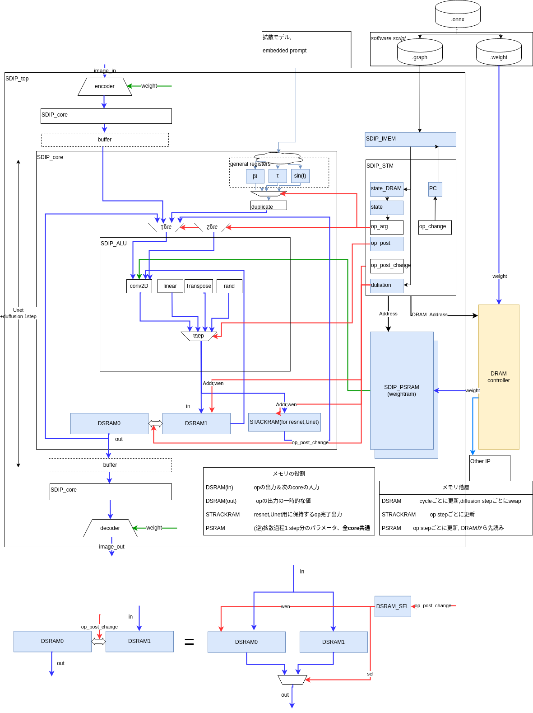

# Stable Diffusion専用プロセッサのアーキテクチャに関する試論

## 概要
画像生成などで使われるアルゴリズムであるStable Diffusionの生成処理を高スループットで実行するための回路アーキテクチャSDIPを提唱する。
またその特性の既存AIアクセラレーターとの比較について述べる。

## 回路構成と機能
数多くある拡散モデルのアルゴリズムのうちVAEで圧縮した隠れ変数に対して拡散過程を適用するlatent diffusionの演算のための回路全体を以下に図示する。

### モジュール
|モジュール名|機能|
|:----|:----|
|SDIP_top|トップモジュール、複数のcoreを持つ|
|SDIP_encoder|VAE encoder|
|SDIP_decoder|VAE decoder|
|SDIP_core|1~数stepの拡散過程を演算するcore|
|SDIP_IMEM|命令メモリ|
|SDIP_STM|ステートマシン|
|SDIP_PSRAM|DRAMから読んだ1step分の重みパラメーターを格納するSRAM|
|SDIP_DSRAM|前段のcoreで計算されたデータと計算途中のデータの保持のためのSRAM|
|SDIP_STACKRAM|Resnet, U-netで必要になるResidual変数の保持のためのスタック|
|SDIP_ALU|各演算器とその出力選択器を含むモジュール|

### 1 coreの動作

onnxファイルから抽出したgraph構造を記述したgraphファイルに基づいて信号op
分岐がなく順番に読み込まれる機械語に相当し以下のようなフォーマットを持つ。

### coreのパイプライン動作

拡散モデルの大きな特徴であるのが複数のstepでデータを生成すること、各ステップで必要になるパラメーターは共通でノイズの分散のみが異なること
である。このため図のように
VAE encoder,decoderだけは
Stable Diffusionの生成処理を高スループットで実行するためのアーキテクチャSDIPの提示と既存AIアクセラレーターとの比較

### onnx変換プログラム
[stable-diffusion-pytorch](https://github.com/kjsman/stable-diffusion-pytorch)の記述に基づくと
[onnxの仕様に定義されたoperation](https://onnx.ai/onnx/operators/)のうち、Stable diffusionの動作に最低限必要なオペレーションは以下のものになる。

|operations|input引数(arg)の数|weight|latencyの次元|
|:----|:----|:----|:----|
|copy|1|無|0|
|add|2|無|0|
|sub|2|無|0|
|mul|2|無|0|
|div|2|無|0|
|rand|0|無|0|
|root|1|無|0|
|softmax|1|無|0|
|relu|1|無|0|
|silu|1|無|0|
|Transpose|1|無|2~|
|Matrix-Vector product|2|無|2|
|Matrix-Matrix product|2|無|2|
|conv2d|1|有|1|
|linear(full connection)|1|有|2|
|linear_batch(full connection)|1|有|2~|
|groupnorm|1|有|2~|
|layernorm|1|有|2~|

groupnorm,layernormに関してはその他参考にしたリンクも参照

$y=\frac{x−E[x]}{\sqrt{Var[x]+\epsilon}}*\gamma+\beta$

これ以外のonnxで定義されたoperationもSDIP_ALU、SDIP_STMに演算、所要サイクルを追加することで拡張可能である。

## 設計空間
SDIPのアーキテクチャでは
- coreの数
- 演算精度(数値のビット幅)
- SRAMのデータ幅
- DRAMとのクロック周波数比率
- 演算回路、SRAMの共有の程度

などが可変なパラメーターとして挙げられその組み合わせの数だけ可能な回路が存在する。Stable Diffusionのような特定のネットワークにおけるデータ転送上のボトルネックを見つけるために回路シミュレーションを利用することができる。
固定されたネットワークパラメーターに対してする生成処理では、演算量、速度は入力画像データ、学習データに依存しない。しかしパラメーターに対して粗行列圧縮や蒸留を用いた場合はその限りではない。
またChiselのコードをVerilogに変換、論理合成を行うことで後述の発展的機能実装も含めて消費電力、回路面積に影響する度合いを評価することができる。

### 演算子の粒度
後述の他のAIアクセラレータと比べるとSDIPは粗粒度といえる。粗粒度はonnxを加工することなく命令列(.graph)を生成できることが利点であり、冗長な演算回路を持つことが欠点である。

### 使用テクノロジー
FPGAあるいはASIC(専用LSI)によって最適な
異なる

最先端の微細化した製造プロセスでは相対的にSRAMの面積、電力コストが高く、ロジックのコストが低くなることが報告されている。このことから冗長な演算回路を許容し、SRAMを節約することが高効率化の鍵となると予想される。
機械学習によって得られた大量のパラメーターの識別、生成処理では
SDIPではALU内の演算回路の共有を行わず、DSRAMとSTACKRAMを共有するなどの回路構成がこの方向性に合致する。

## onnxからのプログラム、重みデータの作成とRAMへの書き込み
onnxを分離、変換することでinstruction, weightを作り、前者はIMEM、後者はDRAMへとデータ処理前に書き込む。データ生成実行時に
ここでは

## 発展的機能実装
現状のSDIPとそのonnx converterでは実装していないが機能、効率化の観点から重要な事項を列挙する。

### 共通パラメータのハードコーディング

画像生成においては学習済みパラメーターを頻繁に変えることはなく入力テキスト(プロンプト)を変更して描きたいや画風を変更するのが
そのため
自然言語処理の分野など用いられる基盤モデルと呼ばれる多くのタスクに共通して使われるニューラルネットは汎用性が高いためハードコーディング

考えられる。
ASIC(専用LSI)で実装する場合には物理的配線が固定され、FPGAで実装する場合は回路情報を記録するSRAMに
AMDのNPU(Neural Processing Unit)は　FPGAをベースにしたものとされ、起動時に回路情報をSRAMに書き込むのと同じ仕組みでニューラルネットパラメーターをNPUに書き込んでいると推測される。FPGAに読み込まれる回路と同様にチップ内でのネットワークの2次元的配置がタイミング制約に影響することも考慮しているかもしれない。

### ベクトル折返し
SRAMのビット幅以上のデータを読み書きする場合には複数サイクルをかけて順番にアクセスする必要がある。データがまた演算回路のビット幅を超えるも同様に複数サイクルに分けて順番に演算が必要になる。これは回路規模とスループットのトレードオフとなる。

### layer fusion
点処理(入力テンソルの1要素にのみ出力が依存する演算)のoperationが連続する場合にはそれを統合して一つのoperationとしてSRAMアクセスを削減すること手法が　AIアクセラレーターの業界ではよく知られている。onnxをgraph、weightに変換する際に加工することで実現できる。

### 暗黙の転置
これもonnxには明示的には書かれないが、効率的な並列演算をするためには必要になり、他社のAIアクセラレーターでも実装されていると思われる。

### 固定小数点化、量子化
一般に機械学習は浮動小数点精度で行われることが多いが、エッジデバイスで推論、生成処理を行う際には重みパラメーターのサイズが問題になることが多く、固定小数点化、8bit,4bit,量子化
量子化により精度を犠牲にして重みパラメーターの容量は　場合によってはメモリが不要になることもある。Chiselのgeneric programmingにより対応が可能であり、精度と性能のトレードオフを探索することもできる。また浮動小数点回路が固定小数点回路、より大きなビット数の回路がより小さなビット数の回路を包含することもできる。
LLMにおいては4bitでも許容可能な精度が出ることが報告されている[^1]。
[^1]: [Faster and More Efficient 4-bit quantized LLM Model Inference](https://openmmlab.medium.com/faster-and-more-efficient-4-bit-quantized-llm-model-inference-a27d35a66c29) 

### 蒸留、動的行列分解、圧縮されたパラメーターの伸長
量子化と比べると精度への影響が小さいものと考えられる。動的行列分解、圧縮されたパラメーターの伸長の演算はCPUなど別の回路に行わせる方法がある。

### 疎行列対応
[Hardware-Software Co-Design of an In-Memory Transformer Network Accelerator](https://www.frontiersin.org/articles/10.3389/felec.2022.847069/full)ではTransformer, Attension(注意機構)で用いられる
AIアクセラレーターの業界ではよく知られている。onnxを加工することで

### 汎用化、あるいはさらなる専用化

各演算回路に並列積和演算器がある状況は冗長である。これらを共有することで回路規模が削減できる。
既に挙げたベクトル折返し、暗黙の転置、のほか　。onnxの演算粒度をより細かい命令列に噛み砕くように変換しなければならず、CPUのマイクロコードに相当するような動的変換が必要になる。

逆に専用化を突き詰める方向としては

### coreごとに異なる重み(weight)の使用
拡散モデル以外のネットワークをパイプライン処理する場合はSDIPでもVAE encoder/decoder部分は拡散モデルとは異なるネットワークである。単純にPSRAMの幅を増やす、あるいは異なるネットワーク分複数のPSRAMを用意する。または各ネットワークで並列に実行されるoperationを隣接するように予めDRAMに置いておくなどの工夫が必要になる。

### 並列ネットワーク
Resnet, U-netのResidual部分の分岐は片方は演算処理せずそのままデータを残しておく構成であった。それ以外の分岐の双方でするネットワークとしてはTransformerに見られるMulti head attentionなどが典型的である。あるいは同一のネットワークを異なる入力データに対して適用する場合もこれに相当する。ネットワークの並列パイプライン実行のハードウェア対応として入出力データ、core間あるいはcore同士の間の連結を分岐させるような接続を追加する必要がある。

### Resnet, U-net以外の分岐するネットワーク対応
Resnet, U-netはResidual dataの作成と消費が入れ子になる形のみ許容しているためstack構造で対応できた。それ以外の分岐を許容すると動的なメモリ確保と開放が必要になりOSによるメモリ管理に近い仕組みが必要になる。
### 多段パイプラインによる動作周波数向上
CPUを含む一般のクロック同期回路と同様に組み合わせ回路の間にパイプラインレジスタを挿入することで動作周波数が向上する。SDIPでは予め直列化され分岐のないgraphを読み込んでいくためハザードによるパイプラインストールが存在せず、常に高効率で演算処理ができるが上記の演算ごとのメモリ分離、スーパースカラー化を行った場合はこの限りではない。

### ステートマシンの分散化
機能的なまとまりの観点からALU内の各演算器がそれぞれステートマシンをもち状態を管理するほうがわかりやすく、operationを追加する際にもSDIP_ALUのみを編集すればよくなる。一方で演算器間の調停は理解が難しくなる。

## 他アーキテクチャとの類似点、相違点
特にサーバー、クラウドを標榜したものだと
[GoogleのTPU]( https://cloud.google.com/tpu/docs/intro-to-tpu?hl=ja)
、[QuadricのChimera GPNPU]()、[Tesla のDojo]()、[tensortorrentのRISC-Vベースのマルチコアプロセッサ]、[graphcoreのIPU]()などがある。これらは拡散モデルも含む大規模なニューラルネット　多くはonnxインターフェースに加えpytorch等のディープラーニング記述を
類似のAIアクセラレーターでは
tensortorrentはCUDAのcupy(PFNによってメンテナンスされている)を　BUDAの開発を標榜している。
画像等を処理するCNNの高速化、低消費電力化のためには隣接するコアでメモリ、レジスタを共有するアーキテクチャが
組み込み系では
一方でSDIPは1 core内部で直線的な計算グラフの演算を完結させ、ハードウェア並列性をデータ並列化ではなくパイプライン化、スループットの向上に用いている。VAEを用いて画像をより次元の小さい潜在変数空間に圧縮するlatent diffusionの構成と親和性が高いと言え、その限界を持っていると思われる。
DRAM転送のボトルネック
このようなlatent diffusionの特質は専らNvidiaを用いｍそのハードウェア的制約のなかで行われている画像生成アルゴリズムの研究開発の歴史の結果として生じたものであると推測でき、上記の他のニューラルアクセラレータを用いた

## まとめ
本文ではStable Diffusion専用プロセッサの構成、動作の一例とその実装のあたって考慮すべき事項、
既存のAIアクセラレーターとの類似点、相違点と拡散モデルや他のアルゴリズムが性能に与える影響について考察した。

## 各社のニューラルアクセラレータに関する情報とニュース
### 各社紹介、ネットニュース
- [tensortorernt RISC-V](https://tenstorrent.com/)
    - [https://tenstorrent.com/risc-v/](risc-vを用い階層的キャッシュを持ったマルチコア、タイリングCPUクラスタ)
- [PFN MN-Core](https://projects.preferred.jp/mn-core/)
    - [PFNにおけるDeep Leaningアクセラレータの開発について(pdf)](https://www.pccluster.org/ja/event/pccc20/data/pccc20_S6_hiraki.pdf)
    - [神戸大学牧野淳一郎先生によるスライド(pdf)](https://jun-makino.sakura.ne.jp/talks/postfugaku-20230222.pdf)
        ハードウェアアーキテクト、ソフトウェア(アプリ)それぞれから見た最適なメモリ階層が図示されている。HBM（High Bandwidth Memory）の困難とそれを解決するであろう3次元実装の紹介もされている。

22 pageの各社アーキテクチャの表の引用

| |MN-Core| Sunway |PEZY| GPU(A100)|
|:----|:----|:----|:----|:----|
|SIMD/MIMD  |SIMD| MIMD |MIMD| SIMDブロック|
|キャッシュ |なし| なし| あり| あり|
|コア間通信 |ツリー| ハイパークロスバー|キャッシュ経由|キャッシュ経由|

MN-Coreは伝統的なスパコンやGPUと異なりキャッシュを持たず、階層的なコア間通信を行う。

- [google TPU](https://cloud.google.com/tpu/docs/intro-to-tpu?hl=ja)  
    - [3世代のTPUに関する講演のまとめ](https://kiszk.github.io/2019/12/31/Three-Generations-of-TPUs/)
- [quadric Chimera GPNPU](https://quadric.io/)
    - [LLMのインポート](https://quadric.io/large-language-models/?gclid=Cj0KCQiAuqKqBhDxARIsAFZELmJYni07gU2dk3cOeVKrDRRpB3sRLt6YRIdaklzRJ9OypwD8PJielawaArTaEALw_wcB)
    大規模言語モデルであるLlamaの移植速度の速さを優位性の指標としている。
-  [Tesla Dojo](https://www.tesla.com/ja_jp/AI)
    - [ホワイトペーパー](https://en.wikipedia.org/wiki/Tesla_Dojo#cite_note-:1-21)
    -AI dayの情報が各所に散在していて[Wikipedia](https://en.wikipedia.org/wiki/Tesla_Dojo#cite_note-:1-21)が比較的まとまっている。
    - https://www.nextplatform.com/2022/08/23/inside-teslas-innovative-and-homegrown-dojo-ai-supercomputer/

- [graphcore IPU](graphcore.ai/ja-jp/)
    - [ベンチマーク](https://www.graphcore.ai/performance-results)
    - [SDKとソフトウェアスタック,dockerが利用できる](https://www.docker.com/ja-jp/blog/graphcore-poplar-sdk-container-images-now-available-on-docker-hub/)
    - [インタビュー記事](https://eetimes.itmedia.co.jp/ee/articles/2209/16/news096.html)クラウドでの学習をターゲットとしている
- [AMD NPU](https://www.amd.com/ja/processors/ryzen)
> AMDによれば、このNPUは、AMDが買収したXilinxのFPGAがベースになっており、そのFPGAのロジックがPhoenixのダイに含まれており、プログラマブルになっているのも大きな特徴だ。 https://pc.watch.impress.co.jp/docs/news/event/1467965.html
- [AMDとXilinxのAI開発プラットフォームを統合](https://monoist.itmedia.co.jp/mn/articles/2206/28/news050_3.html)

### 論文
- [Co-Design of an In-Memory Transformer Network Accelerator](https://www.frontiersin.org/articles/10.3389/felec.2022.847069/full　Hardware-Software)

    疎行列処理に対応しLLMをターゲットとしたアクセラレータであり、CMOSと共存でき演算回路に近接した不揮発性の強誘電体電界効果トランジスタ (FeFET)をメモリとして重みパラメーターを記憶させている。Processing-in-memory (PIM)と呼ばれるこの技術によってメモリ帯域幅のボトルネックを解決している。

- [Symphony: Orchestrating Sparse and Dense Tensors with Hierarchical Heterogeneous Processing](https://dspace.mit.edu/handle/1721.1/152619)
    メモリ階層全体のデータ編成の最適化を行うことで疎テンソルと密テンソルを共存、協調させた設計

### その他参考にしたリンク
- layernorm,groupnormについて
    - 元論文[Group normalization](https://arxiv.org/abs/1803.08494)
    - https://gaoxiangluo.github.io/2021/08/01/Group-Norm-Batch-Norm-Instance-Norm-which-is-better/
    - https://zuoli.tech/?p=191